# stripR: a tool to support strip mapping


Strip maps are a type of maps which typically show a linear feature
(think of a river, a road, or an itinerary) and their immediate
surroundings. They often also distort the geography in order to show the
feature as a long and thin strip, or a ribbon.

There are currently no other tools, as far as I am aware, to process
spatial data to support the kind of strip maps where linear features are
straightened to follow given shapes. This package fills the gap. The
package is able to rotate and shift continuous rasters and vector
features based on a skeleton line feature to straighten.

## Installing the package

The package currently lives only in github, and can be installed with
devtools.

``` r
devtools::install_github("mkkallio/stripR")
```

## Basic principle in stripR

Straightening, or *stripping*, is based on linestrings, and
Douglas-Peucker algorithm (DP). A line feature is simplified with some
tolerance. The DP algorithm and the feature is rotated and shifted at
each node the algorithm picks. To illustrate, let’s look at this
recording of a 200 km bike ride in Southern Finland and a DEM from the
National Land Survey of Finland in the background.

``` r
library(terra)
library(sf)
library(stripR)
library(dplyr)
library(tictoc)

data("example_line")
path <- system.file("extdata", 
                    "example_raster.tif", 
                    package="stripR")
dem <- rast(path)

plot(dem)
plot(example_line, add=TRUE, col = "black")
```

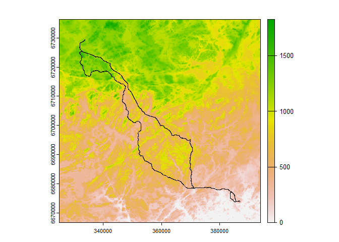

The route of the bike ride is pretty far from a straight line. But no
worry, straightening a line is relatively simple. The function
\_straighten_line()\_ applies the DP algorithm and the degree of with
specified tolerance, and the angle of direction the line should take.

``` r
str_10k <- straighten_line(example_line, 
                             tolerance = 10000,
                             angle = 0)

plot(rbind(str_10k$Ribbon, str_10k$Skeleton))
```

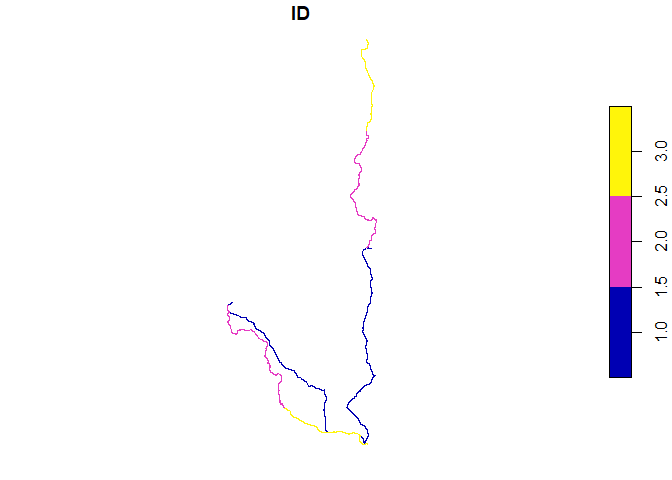

With a tolerance 10 000 meters, the route is split in 3 sections, and
the straightened line is set to begin at the same node as the original
line. Tolerance controls how straight the line will be. If I set the
tolerance to 2 km, the line will be split to 17 segments and thus the
line will be significantly more straight.

``` r
str_2k <- straighten_line(example_line,
                           tolerance = 2000,                           
                           angle = -90)  

plot(rbind(str_2k$Ribbon, str_2k$Skeleton))
```

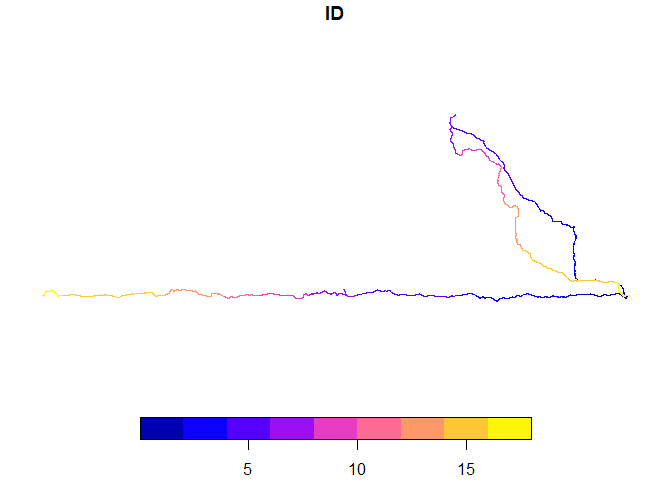

Each segment is rotated so that the angle between the start and end
nodes of the segment equals the angle provided, and each segment is
placed in sequence.

## Working with rasters

Just straightening line features does not get us very far in creating
interesting maps, but luckily stripR provides facilities for this! Strip
maps generally show only the immediate surroundings of the central
linear feature. In *strip_raster()* this is implemented with buffers
along the straightened line segments.

``` r
tic()
strip <- strip_raster(example_line, 
                      dem,
                      tolerance = 3000,
                      buffer_size = 5000)
toc()
```

    8.78 sec elapsed

``` r
plot(strip$rotated_r)
plot(strip$rotated_line, add=TRUE)
```

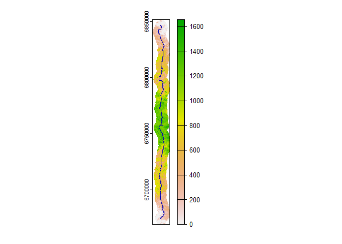

A detailed explanation of the inner workings here is coming later, but
what is important here is that the discontinuities in the rotated and
shifted rasters, specific to the line segments, are blended together
based on distances to the straighted line segments. The result is a
realistic looking continuous raster with some unavoidable smoothing
around segment joints. To get an idea where the DEM is blended, look for
the overlaps between segment buffers.

``` r
buffers <- st_buffer(strip$rotated_line, 5000)

plot(strip$rotated_r)
plot(st_geometry(buffers), add=TRUE)
```

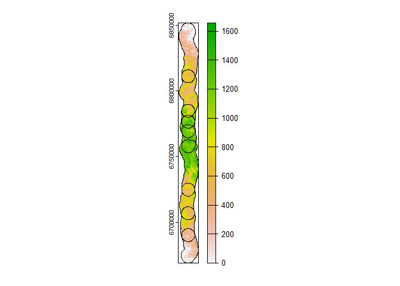

### Force arbitrary shapes

There is no specific reason why the strip map needs to be a straight
line. We can therefore force the strip to take an arbitrary shape! The
target shape is a combination of the straightened line from
*straighten_line()* and a list of lengths and angles determining the
shape. We can also create the lengths and lists from provided shapes,
simplified again with the DP algorithm.

``` r
data("target_shapes")

shape <- create_shape(target_shapes[2,], 3000)
shape
```

    $shape
    Simple feature collection with 8 features and 1 field
    Geometry type: LINESTRING
    Dimension:     XY
    Bounding box:  xmin: 445796.4 ymin: 7150461 xmax: 552109.9 ymax: 7251526
    Projected CRS: ETRS89 / TM35FIN(E,N)
      id                              l
    1  1 LINESTRING (455663.6 716942...
    2  2 LINESTRING (445796.4 720077...
    3  3 LINESTRING (454644.1 722966...
    4  4 LINESTRING (480378.2 725011...
    5  5 LINESTRING (513216.3 725152...
    6  6 LINESTRING (540615.4 723337...
    7  7 LINESTRING (552109.9 720257...
    8  8 LINESTRING (543309.3 717090...

    $lengths
           1        2        3        4        5        6        7        8 
    32868.63 30209.33 32868.63 32868.63 32868.63 32868.63 32868.63 32868.63 

    $angles
            1         2         3         4         5         6         7         8 
    342.53038  17.03038  51.53038  87.53038 123.53038 159.53038 195.53038 231.53038 

``` r
plot(target_shapes[2,])
```

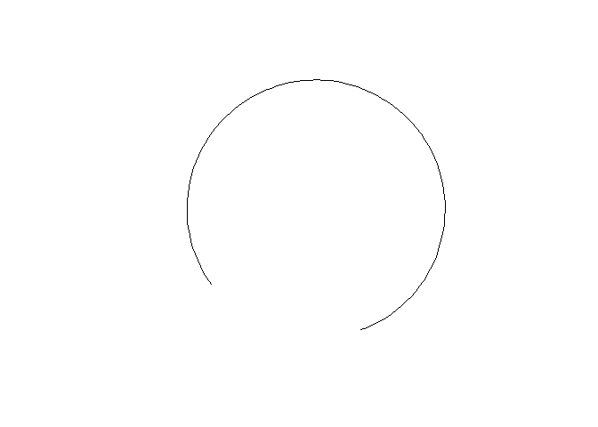

``` r
plot(shape$shape)
```

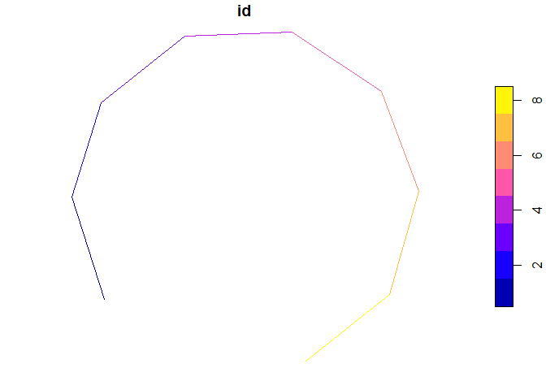

This freedom offers a drawback: forcing a straightened line to take a
certain shape will create many more points where the line and raster
need to be rotated and shifted, as exemplified by the overlapping
buffers below. This also leads to much longer processing time.

``` r
tic()
round_strip <- strip_raster(example_line,
                            dem,
                            tolerance = 3000,
                            buffer_size = 5000,
                            shape = shape)
toc()
```

    73.13 sec elapsed

``` r
round_buffers <- st_buffer(round_strip$rotated_line, 5000)


plot(round_strip$rotated_r)
plot(st_geometry(round_strip$rotated_line), add = TRUE)
plot(st_geometry(round_buffers), add = TRUE)
```

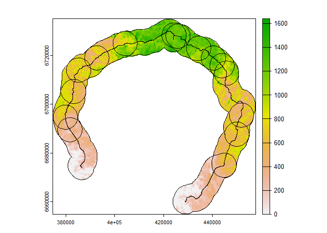

There is no need to use the *create_shape()*-function:

``` r
shape <- list(lengths = c(1,2,3,2,1),
              angles = c(-90, 0, 90, 180, -90))

tic()
rect_strip <- strip_raster(example_line,
                            dem,
                            tolerance = 3000,
                            buffer_size = 5000,
                            shape = shape)
toc()
```

    36.74 sec elapsed

``` r
rect_buffers <- st_buffer(rect_strip$rotated_line, 5000)


plot(rect_strip$rotated_r)
plot(st_geometry(rect_strip$rotated_line), add = TRUE)
plot(st_geometry(rect_buffers), add = TRUE)
```

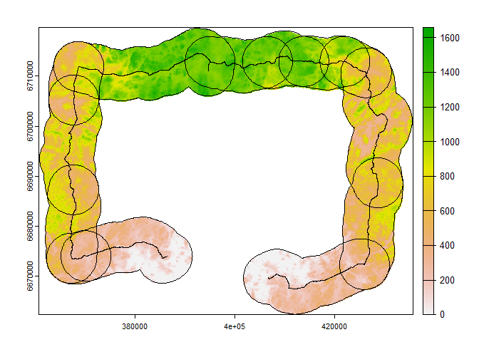

Note that currently **stripR can only handle continuous rasters**, and
not categorical ones.

## Working with vectors

Rotating and moving vector features is a simple task, but unlike
continuous rasters, handling the segement joints is more tricky. Just
like with the rasters, rotating and moving vectors will lead to overlap
at the points of rotation, but unlike a continuous raster, “blending”
vectors is not so straight forward. Let’s have a look how this is
handled in stripR.

``` r
data("example_buildings")
data("example_road")

plot(rbind(example_buildings, example_road))
```

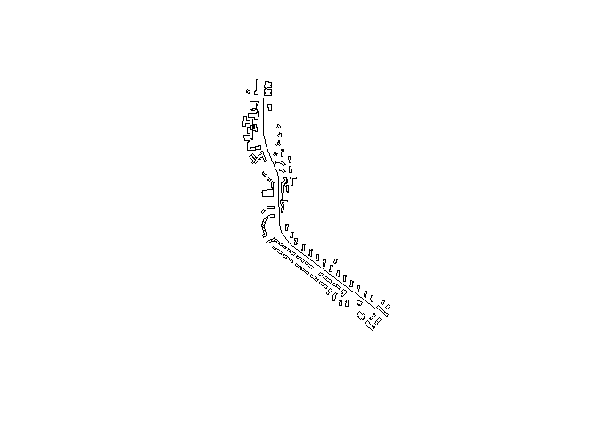

The use of *strip_vector()* is similar to the raster version, with some
added arguments.

``` r
tic()
strip <- strip_vector(example_road,
                      example_buildings,
                      tolerance = 200,
                      buffer = 200,
                      remove_overlap = FALSE)
toc()
```

    0.22 sec elapsed

``` r
plot(st_geometry(strip$rotated_v))
plot(st_geometry(strip$rotated_line), add=TRUE)
```

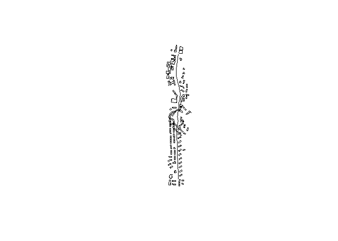

Let’s have a look closer at the segment where the split and rotation is
made. By rotating and moving features, there is distinct overlap.

``` r
buffers <- st_buffer(strip$rotated_line, 300)
int <- st_intersection(buffers[1,], buffers[2,])

plot(st_geometry(int))
plot(st_geometry(strip$rotated_v), add=TRUE)
plot(st_geometry(strip$rotated_line), add=TRUE)
```

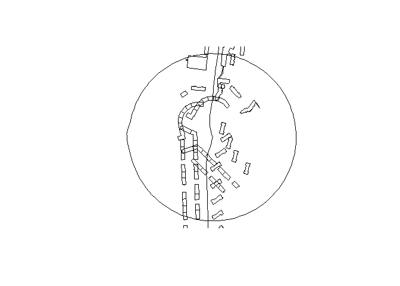

Currently there are two ways to handle this, based on a transect line
drawn at the segment joint. First, we can remove all features on the
wrong side of the transect, which looks much cleaner.

``` r
strip <- strip_vector(example_road,
                      example_buildings,
                      tolerance = 200,
                      buffer = 200,
                      remove_overlap = TRUE)

plot(st_geometry(int))
plot(st_geometry(strip$rotated_v), add=TRUE)
plot(st_geometry(strip$rotated_line), add=TRUE)
```

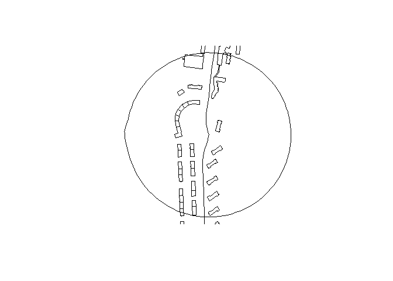

However, the rotated vector features can be large enough that a part of
them will extend to the wrong side of the transect. For these cases, the
features can be split at the transect and only the part on the wrong
side is removed. In this example it is a bit hard to see, but the
biggest difference is an additional building on the right side of the
road, which was removed when no splitting was done.

``` r
strip <- strip_vector(example_road,
                      example_buildings,
                      tolerance = 200,
                      buffer = 200,
                      remove_overlap = TRUE,
                      split_features = TRUE)

plot(st_geometry(int))
plot(st_geometry(strip$rotated_v), add=TRUE)
plot(st_geometry(strip$rotated_line), add=TRUE)
```

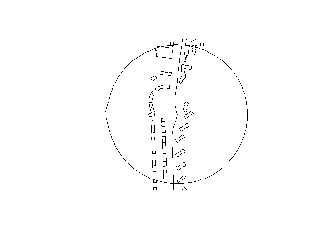

Vectors can also be forced to an arbitrary shape.

``` r
strip <- strip_vector(example_road,
                      example_buildings,
                      tolerance = 200,
                      buffer = 200,
                      shape = create_shape(target_shapes[1,], 3000),
                      remove_overlap = TRUE,
                      split_features = FALSE)

# plot(st_geometry(int))
plot(st_geometry(strip$rotated_v))
plot(st_geometry(strip$rotated_line), add=TRUE)
```

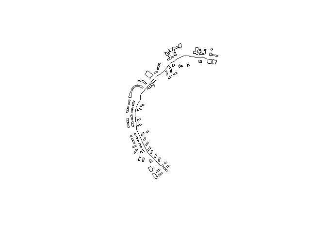

At the present, however, vectors will likely need to be manually
processed near the joints.

## Future developments

The package is still in very early development and requires proper
optimisation, code clean and testing. Some future features coming up is:

- Develop strip mapping based on transects

- Add more options to handling vectors

- Add a process for categorical rasters

In the meanwhile, posting issues in Github for bug reports, feature
requests etc. is highly appreciated!
